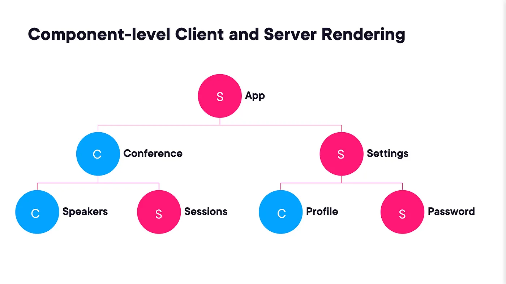

# Next 13

## Server and client components

### Attachment rules

- you cannot import a server component inside a client component
- you can forward server components to client ones as `children`

Use client components when:

- need to use hooks
- when event handlers for user actions are needed
- when using the browser API
- when a class component is used

Use server components when:

- you receive data through the server API
- when you need direct access to backend resources
- when sensitive information is used (API keys, tokens, etc.)
